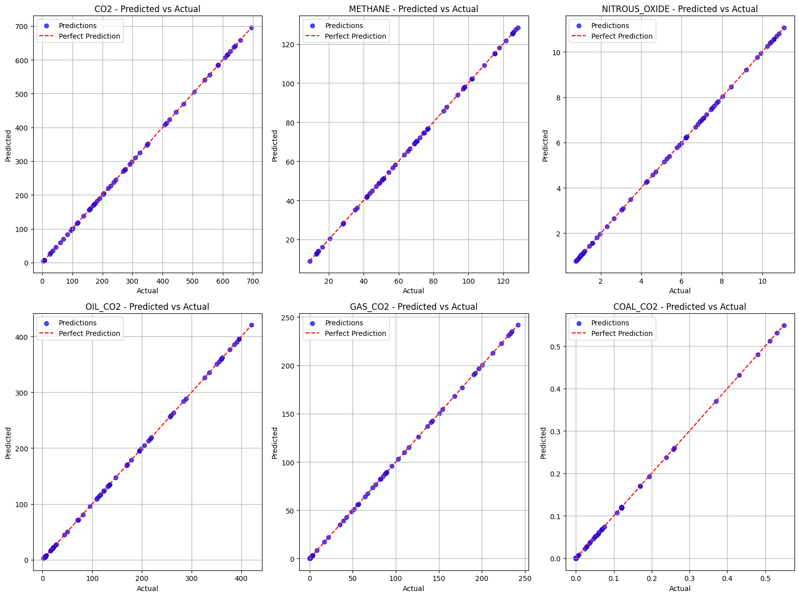
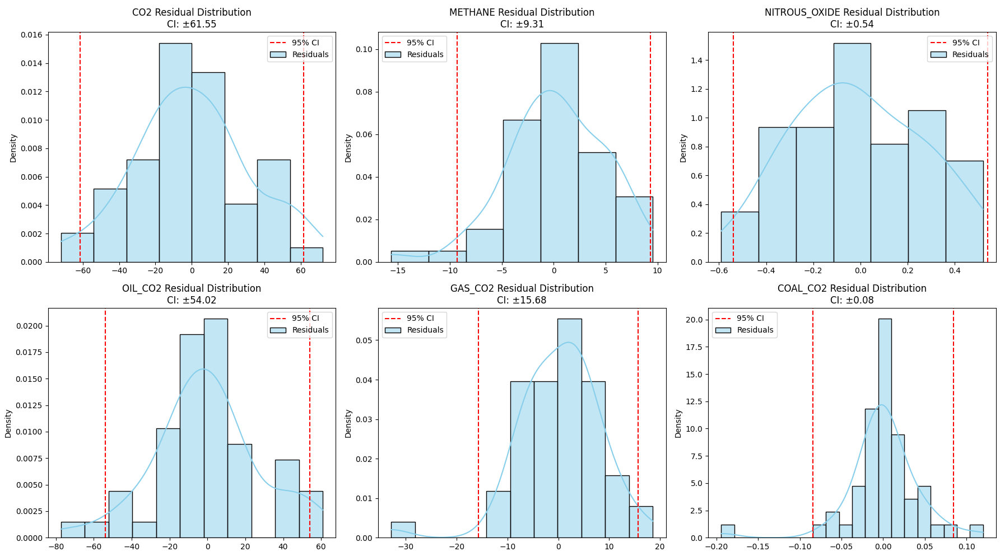

# Predictive Analytics for Enhancing Sustainability in Petroleum Operations
Note: The Flask web application, IoT hardware scripts, and Docker configuration are not included in this repository. This repo contains the data preprocessing pipeline and ML model notebooks only.

> A graduation project by **Moataz Al Khaldi**, Mohammed Hussain Harb, and Ziyad Khaled BuDokhi  
> King Faisal University — College of Computer Science & Information Technology  
> Supervised by Dr. Khaled Riad

---

## Table of Contents

- [Overview](#overview)
- [System Architecture](#system-architecture)
- [Features](#features)
- [Machine Learning Models](#machine-learning-models)
  - [XGBoost (Multi-Output)](#xgboost-multi-output)
  - [LSTM (Multi-Output)](#lstm-multi-output)
- [Results](#results)
- [Data Pipeline](#data-pipeline)
- [Hardware (IoT)](#hardware-iot)
- [Web Application](#web-application)
- [Project Structure](#project-structure)
- [Setup & Installation](#setup--installation)
- [Notebooks](#notebooks)
- [Team](#team)

---

## Overview

Saudi Arabia's petroleum sector is one of the world's largest contributors to greenhouse gas (GHG) emissions. This project builds an end-to-end **IoT + ML system** to:

1. **Monitor** real-time CO₂ concentrations using a Raspberry Pi 5 + Adafruit SCD-30 sensor
2. **Forecast** six GHG emission targets — `co2`, `methane`, `nitrous_oxide`, `oil_co2`, `gas_co2`, `coal_co2` — from petroleum operational metrics
3. **Deliver** predictions through a role-based web dashboard for Oil Operators and Environmental Regulators

Two complementary models were developed and evaluated under Leave-One-Out Cross-Validation (LOOCV): a gradient-boosted tree ensemble (XGBoost) and a stacked LSTM network. XGBoost serves as the primary deployed model with R² ≈ 1.0 and MAPE < 0.1% across most targets.

---

## System Architecture

```
┌──────────────────────────────────────────────────────────┐
│                    Presentation Layer                    │
│         Web UI  ·  Role-Specific View  ·  Dashboard      │
├──────────────────────────────────────────────────────────┤
│                     Functional Layer                     │
│   Emission Prediction · CO₂ Detection · RBAC Auth        │
├──────────────────────────────────────────────────────────┤
│                      Business Layer                      │
│   Emissions Standards · Efficiency Metrics · Validation  │
├──────────────────────────────────────────────────────────┤
│                  Application Core Layer                  │
│     Model Processing · Data Preprocessing · Real-time    │
├──────────────────────────────────────────────────────────┤
│                      Database Layer                      │
│               MySQL (Docker) · MongoDB                   │
└──────────────────────────────────────────────────────────┘
              ▲
    Raspberry Pi 5 + SCD-30 (I²C) — Live CO₂ sensor
```

---

## Features

| Feature | Description |
|---|---|
| **Live CO₂ Monitoring** | Sensor readings every 2 seconds, streamed to MySQL via Docker |
| **GHG Forecasting** | Predict 6 emission targets from fuel consumption inputs |
| **Role-Based Access** | Separate dashboards for Oil Operators and Environmental Regulators |
| **Report Generation** | Download single or batch PDF reports with emission summaries |
| **Multi-Channel Alerts** | Email → Telegram → on-site buzzer when CO₂ thresholds are breached |
| **LOOCV Evaluation** | Rigorous leave-one-out validation due to small annual dataset |

---

## Machine Learning Models

### XGBoost (Multi-Output)

**Notebook:** `02_xgboost_multioutput.ipynb`

Pipeline: `SimpleImputer → StandardScaler → MultiOutputRegressor(XGBRegressor)`

Hyperparameter search via `GridSearchCV + LOOCV` over:
- `n_estimators`: [100, 200]
- `max_depth`: [3, 5]
- `learning_rate`: [0.01, 0.05, 0.1]
- `subsample`: [0.8, 1.0]
- `colsample_bytree`: [0.8, 1.0]

**Best config:** `colsample_bytree=1.0, learning_rate=0.1` (selected by min neg-MSE across 60 LOOCV folds × 48 candidates = 2880 fits)

#### Predicted vs Actual



All six targets track the perfect-prediction diagonal extremely closely, confirming near-zero bias across the full emission range.

#### Confidence Intervals (95% CI from LOOCV Residuals)


Residuals are tightly symmetric around zero for all targets. CO₂ CI: ±0.0198, Methane: ±0.0101, Nitrous Oxide: ±0.0037 — all in normalised space.

#### Performance Summary

| Target | R² | MAE | MSE | MAPE | sMAPE |
|---|---|---|---|---|---|
| CO₂ | **1.0** | 0.0374 | 0.0023 | 0.074% | 0.074% |
| Methane | **1.0** | 0.00912 | 0.00015 | 0.022% | 0.022% |
| Nitrous Oxide | **1.0** | 0.00077 | 0.0 | 0.032% | 0.032% |
| Oil CO₂ | **1.0** | 0.01856 | 0.00057 | 0.069% | 0.069% |
| Gas CO₂ | **1.0** | 0.01038 | 0.00019 | 4.09% | — |
| Coal CO₂ | **0.99998** | 0.00048 | 0.0 | — | — |

> Gas CO₂ MAPE is inflated by near-zero values in early years — sMAPE is a more reliable metric for this target.

---

### LSTM (Multi-Output)

**Notebook:** `03_lstm_multioutput.ipynb`

**Architecture:**
```
LSTM(64, return_sequences=True)
Dropout(0.2)
LSTM(32)
Dense(6)
```

- **Loss:** Huber (robust to outliers)
- **Optimizer:** Adam (lr=0.001)
- **Sequence length:** 6 years → predict year 7
- **Validation:** LOOCV (150 epochs per fold)

**Input features:** `Diesel`, `Kerosene`, `Crude Oil Production`, `Gasoline`, `oil_co2`, `cumulative_ghg`

#### Predicted vs Actual


Strong trend capture for CO₂, Methane, and Nitrous Oxide. The model shows some scatter at high CO₂ values (>400 Mt), consistent with limited high-emission examples in the training sequence.

#### Confidence Intervals



CO₂ CI: ±61.55 (original units), OIL_CO₂: ±54.02, GAS_CO₂: ±15.68. Wider than XGBoost, reflecting LSTM's higher variance under LOOCV on a small dataset.

#### Performance Summary (CO₂ only)

| Metric | R² | MAE | MSE | MAPE | sMAPE |
|---|---|---|---|---|---|
| CO₂ | 0.96 | 27.5 | 1449 | 4.3% | 4.4% |

---

## Results

### Correlation Heatmap


Key observations:
- `co2` and `total_ghg` are nearly perfectly correlated (0.97–1.00) — the features share a common trajectory
- `oil_co2`, `gas_co2`, `population`, and `Diesel` all show strong positive correlation with CO₂ (>0.95)
- `co2_per_unit_energy`, `co2_growth_prct`, and `co2_per_gdp` are near-zero or negative — correctly excluded from training to prevent leakage

### Feature Importance (ANOVA F-Score, target = CO₂)

| Rank | Feature | F-Score |
|---|---|---|
| 1 | total_ghg | 49,880.8 |
| 2 | oil_co2 | 3,862.9 |
| 3 | population | 2,535.9 |
| 4 | gas_co2 | 1,753.1 |
| 5 | cumulative_oil_co2 | 1,139.8 |
| 6 | methane | 1,079.7 |
| 7 | primary_energy_consumption | 451.2 |
| 8 | nitrous_oxide | 754.9 |
| 9 | Diesel | 527.4 |
| 10 | Gasoline | 181.4 |

### LSTM vs XGBoost — Model Comparison

| Criterion | XGBoost | LSTM |
|---|---|---|
| R² (CO₂) | ~1.0 | 0.96 |
| MAPE (CO₂) | 0.074% | 4.3% |
| CI width (CO₂) | ±0.02 (norm.) | ±61.55 (raw) |
| Training time | Fast | Slow (LOOCV × 150 epochs) |
| Data engineering | Tabular only | Sequence windows (SEQ_LEN=6) |
| Deployed | ✅ Yes | ❌ Standby |

Ensemble between the two models was deferred due to incompatible input structures (sequence vs. tabular) and preprocessing pipelines (MinMaxScaler vs. StandardScaler).

---

## Data Pipeline

**Notebook:** `01_data_preprocessing.ipynb`

### Sources

| Dataset | Source | Description |
|---|---|---|
| OWID CO₂ & GHG Data | Our World in Data | Historical Saudi Arabia emissions by source |
| SAMA Statistical Report | Saudi Central Bank | Annual oil production and refined product volumes |

### Preprocessing Steps

1. **Load** both datasets from CSV/XLSX
2. **Clean** SAMA headers (data starts at row 2), filter non-numeric rows
3. **Rename** columns: `Total (1)` → `Crude Oil Production`, `Diesel (2)` → `Diesel`, etc.
4. **Inner join** on `year`
5. **Impute** missing values (column mean via `SimpleImputer`)
6. **Drop** leakage-prone columns: `co2_per_unit_energy`, `co2_growth_prct`, `co2_per_gdp`, `flaring_co2`, `flaring_co2_per_capita`, `co2_per_capita`, `methane_per_capita`, `primary_energy_consumption`
7. **Engineer** `cumulative_ghg = cumsum(methane) + cumsum(co2) + cumsum(nitrous_oxide)`
8. **Export** → `data/merged_co2_energy_dataset.csv`

---

## Hardware (IoT)

| Component | Spec |
|---|---|
| SBC | Raspberry Pi 5 (8GB, quad-core A76 @ 2.4 GHz) |
| Sensor | Adafruit SCD-30 (NDIR CO₂ + SHT31 temp/humidity) |
| Interface | I²C (SDA → GPIO2, SCL → GPIO3) |
| Power | USB-C (5V) |
| Database | MySQL 8 in Docker (port 3307) |
| Reading interval | 2 seconds (raw) / 1 minute (summary) |

The SCD-30 is configured to capture CO₂ only. Readings are timestamped and inserted into `co2_readings`. A background Flask thread computes 1-minute MIN/MAX/AVG into `co2_summary`.

**Alert thresholds:**

| Level | Threshold | Action |
|---|---|---|
| Warning | > 1000 ppm | Email alert |
| Critical | > 2000 ppm | Telegram message |
| Severe | > 3000 ppm | On-site buzzer |

---

## Web Application

Built with **Flask** + **MySQL** (Docker). Role-based access via RBAC authentication.

### Pages

| Page | Role | Description |
|---|---|---|
| Sign In / Sign Up | All | Auth with role selection (Operator / Regulator) |
| Oil Operator Dashboard | Operator | Submit daily fuel metrics (Crude Oil, Diesel, Gasoline, Kerosene) |
| Live CO₂ Monitoring | Operator | Real-time readings, trend chart, sensor status |
| CO₂ Emissions Prediction | Regulator | Input fuel data → instant GHG prediction |
| Reports Dashboard | Regulator | View, filter, and download emission records as PDF |

### Screenshot: XGBoost LOOCV Confidence Intervals (Terminal Output)


```
--- CO2 ---         95% CI: (-0.01388, 0.01128)
--- METHANE ---     95% CI: (-0.00341, 0.00292)
--- NITROUS_OXIDE - 95% CI: (-0.00023, 0.00028)
--- OIL_CO2 ---     95% CI: (-0.00629, 0.00617)
--- GAS_CO2 ---     95% CI: (-0.00389, 0.00324)
--- COAL_CO2 ---    95% CI: (-0.00016, 0.00015)
```

---

## Project Structure

```
.
├── data/
│   ├── Reordered_Saudi_Arabia_CO2_and_GHG_Data.csv
│   ├── SAMA_StatisticalReport.xlsx
│   └── merged_co2_energy_dataset.csv          # generated by notebook 01
│
├── notebooks/
│   ├── 01_data_preprocessing.ipynb
│   ├── 02_xgboost_multioutput.ipynb
│   └── 03_lstm_multioutput.ipynb
│
├── outputs/
│   ├── xgb_multioutput_model.pkl              # saved XGBoost pipeline
│   ├── xgboost_multioutput_residuals.png
│   ├── lstm_predicted_vs_actual.png
│   └── lstm_residual_distributions.png
│
├── hardware/
│   └── sensor_reader.py                       # Raspberry Pi SCD-30 script
│
├── app/                                       # Flask web application
│   ├── app.py
│   ├── templates/
│   └── static/
│
├── docker-compose.yml                         # MySQL container
└── README.md
```

---

## Setup & Installation

### 1. Python Environment

```bash
pip install pandas numpy matplotlib seaborn scikit-learn xgboost tensorflow joblib
```

### 2. Run Notebooks in Order

```bash
jupyter notebook notebooks/01_data_preprocessing.ipynb   # merge & export data
jupyter notebook notebooks/02_xgboost_multioutput.ipynb  # train & save XGBoost
jupyter notebook notebooks/03_lstm_multioutput.ipynb     # train & evaluate LSTM
```

### 3. Start the Database

```bash
docker-compose up -d
```

### 4. Run the Web Application

```bash
cd app
python app.py
```

### 5. Raspberry Pi Sensor (Optional)

```bash
pip install adafruit-circuitpython-scd30 mysql-connector-python
python hardware/sensor_reader.py
```

---

## Notebooks

| Notebook | Purpose |
|---|---|
| `01_data_preprocessing.ipynb` | Load, clean, merge, feature-select, export dataset |
| `02_xgboost_multioutput.ipynb` | Multi-output XGBoost with GridSearchCV + LOOCV, residual analysis |
| `03_lstm_multioutput.ipynb` | 2-layer LSTM with LOOCV, Huber loss, inverse-transform evaluation |

---

## Team

| Name | Role |
|---|---|
| **Moataz Al Khaldi** | ML development, data pipeline, system integration |
| **Mohammed Hussain Harb** | Web application, database, hardware |
| **Ziyad Khaled BuDokhi** | IoT hardware, frontend, testing |

**Supervisor:** Dr. Khaled Riad  
**Committee Member:** Dr. Ahmad Afifi  
**Institution:** King Faisal University, College of Computer Science & Information Technology

---

## License

This project was submitted in partial fulfillment of the requirements for the degree of Bachelor of Science in Computer Science at King Faisal University. All rights reserved by the authors.
